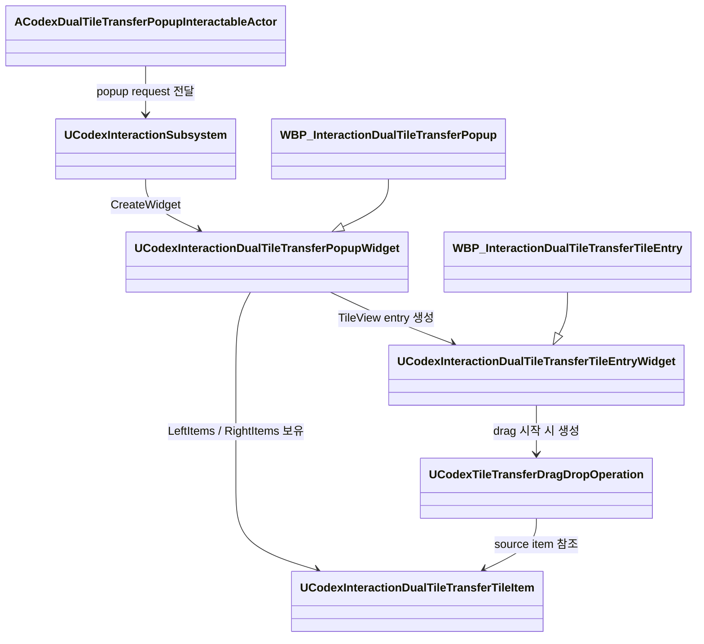
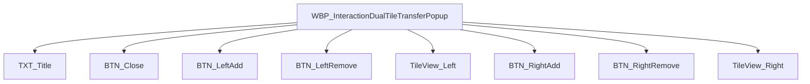
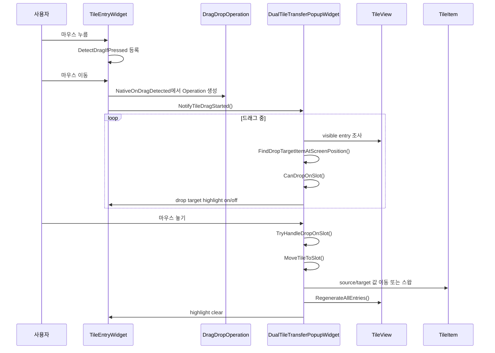
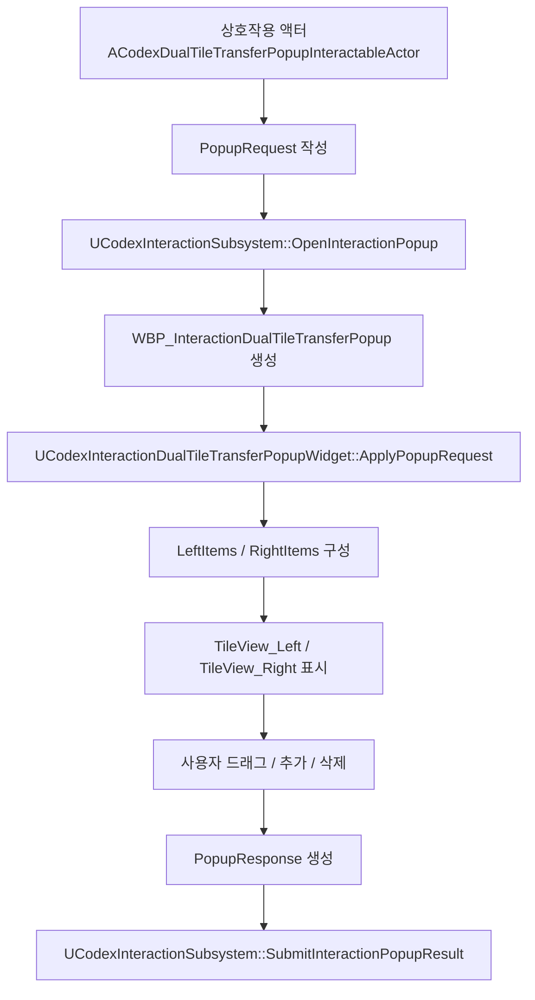

# 듀얼 타일뷰 UMG 학습 가이드

## 문서 목적
- 이 문서는 `Dual Tile Transfer Popup` 구현을 통해 Unreal UMG의 `TileView`, `UUserWidget`, `IUserObjectListEntry`, 드래그 앤 드롭 구조를 학습하기 위한 설명서다.
- 특히 드래그 앤 드롭이 실제 코드에서 어떻게 흘러가는지 기초부터 쉽게 설명하는 데 집중한다.
- 이 문서를 읽은 뒤에는 아래를 이해하는 것을 목표로 한다.
  - `TileView`가 item과 entry widget을 어떻게 다루는지
  - 빈칸이 있는 슬롯형 UI를 UMG에서 어떻게 모델링하는지
  - 드래그 시작, hover, drop, highlight, swap이 어떤 순서로 동작하는지
  - 왜 이번 구현이 `팝업 중앙 처리` 구조를 선택했는지

## 먼저 알아둘 핵심 개념

### 1. UMG에서 `TileView`는 "위젯 목록"이 아니라 "데이터 목록"을 보여준다
- `TileView`에 직접 위젯을 넣는 것이 아니다.
- `TileView`에는 `UObject` item 목록을 넣고, 각 item을 어떻게 그릴지는 entry widget이 맡는다.
- 이 프로젝트에서는 슬롯 하나를 `UCodexInteractionDualTileTransferTileItem`이 표현한다.

즉, 구조는 이렇게 이해하면 된다.

```text
TileView
  -> 아이템 목록(UObject 배열)
  -> 화면에 보이는 아이템에 대해서만 entry widget 생성
  -> entry widget은 item 데이터를 읽어서 그림
```

### 2. item과 entry widget은 다른 역할이다
- item: 데이터
- entry widget: 화면 표현

이 구현에서는:
- `UCodexInteractionDualTileTransferTileItem`
  - 슬롯 번호
  - 숫자 값
  - 빈칸 여부
  - 좌/우 패널 구분
  - 선택 상태
- `UCodexInteractionDualTileTransferTileEntryWidget`
  - 숫자 텍스트 표시
  - 배경 색 표시
  - 선택 아웃라인 표시
  - 드래그 시작

### 3. `TileView` entry는 영구 객체가 아니다
- `TileView`는 스크롤과 가상화를 위해 entry widget을 재사용하거나 다시 만든다.
- 그래서 "이 entry widget이 항상 이 슬롯을 대표한다"라고 가정하면 자주 깨진다.
- 이번 작업에서 드래그 관련 버그가 반복된 이유도 여기에 가깝다.

이 점이 중요하다.
- entry widget은 "임시 화면 표현"이다.
- 진짜 상태는 item 배열과 popup widget이 들고 있어야 한다.

## 이번 구현에서 보는 전체 구조

### 관련 클래스
- `ACodexDualTileTransferPopupInteractableActor`
  - 팝업을 여는 테스트용 상호작용 액터
- `UCodexInteractionSubsystem`
  - 팝업 생성, 표시, 결과 회수 담당
- `UCodexInteractionDualTileTransferPopupWidget`
  - 듀얼 타일 팝업 본체
- `UCodexInteractionDualTileTransferTileEntryWidget`
  - 슬롯 하나를 그리는 entry widget
- `UCodexInteractionDualTileTransferTileItem`
  - 슬롯 데이터
- `UCodexTileTransferDragDropOperation`
  - 드래그 중 들고 다니는 payload

### 실제 WBP 애셋 관계
- `/Game/UI/Interaction/WBP_InteractionDualTileTransferPopup`
  - native class: `UCodexInteractionDualTileTransferPopupWidget`
- `/Game/UI/Interaction/WBP_InteractionDualTileTransferTileEntry`
  - native class: `UCodexInteractionDualTileTransferTileEntryWidget`

즉, C++와 WBP는 이렇게 연결된다.



## WBP 구조를 먼저 눈으로 이해하기

### 팝업 본체 WBP
- 상단
  - `TXT_Title`
  - `BTN_Close`
- 좌측 패널
  - `BTN_LeftAdd`
  - `BTN_LeftRemove`
  - `TileView_Left`
- 우측 패널
  - `BTN_RightAdd`
  - `BTN_RightRemove`
  - `TileView_Right`

### 타일 entry WBP
- `IMG_TileBackground`
- `TXT_Number`
- `Border_SelectedOutline`

이 구조는 `BindWidget`으로 C++에 연결된다.



## 슬롯 데이터 모델 이해하기

### 왜 "타일"이 아니라 "슬롯"으로 모델링했는가
사용자 요구사항은 단순히 좌우 패널 사이 이동이 아니었다.

원한 동작:
- 같은 패널 안에서도 순서 변경 가능
- 빈칸으로 이동 가능
- 차 있는 칸에 놓으면 스왑 가능

이 요구를 구현하려면 "타일 배열"보다 "슬롯 배열"이 맞다.

예를 들어 좌측 패널이 이렇게 생겼다고 하자.

```text
[1][2][ ][4]
```

이걸 배열로 표현하면:

```text
[1, 2, 0, 4]
```

여기서 `0`은 빈칸이다.

그래서 `UCodexInteractionDualTileTransferTileItem`은 "숫자 item"이 아니라 "슬롯 item"이다.

### `UCodexInteractionDualTileTransferTileItem` 필드 의미
- `SlotIndex`
  - 패널 안에서 몇 번째 슬롯인지
- `Number`
  - 슬롯에 들어 있는 숫자
- `TintColor`
  - 배경 색
- `bIsEmpty`
  - 빈칸인지
- `bIsSelected`
  - 선택됐는지
- `PanelSide`
  - 왼쪽인지 오른쪽인지

핵심 헬퍼:

```cpp
bool HasNumber() const
{
    return !bIsEmpty && Number > 0;
}
```

이 함수 덕분에 코드가 많이 단순해진다.
- 숫자 있는 슬롯인가?
- 드래그 가능한가?
- Remove 버튼 활성화 가능한가?
- 결과 배열에 0을 넣어야 하는가?

## 팝업이 상태를 어떻게 들고 있는가

`UCodexInteractionDualTileTransferPopupWidget`는 두 패널을 이렇게 관리한다.

- `LeftItems`
- `RightItems`
- `LeftSelectedItem`
- `RightSelectedItem`
- `HoveredDropTargetItem`

즉, 진짜 상태 소유자는 popup widget이다.

entry widget은:
- 상태를 소유하지 않는다.
- popup이 가진 item을 잠깐 받아서 그린다.

이 점이 매우 중요하다.

## `TileView`와 entry widget의 관계

### entry widget은 언제 item을 받는가
`IUserObjectListEntry`를 구현하면 `NativeOnListItemObjectSet()`가 호출된다.

이 구현에서는:

```cpp
void UCodexInteractionDualTileTransferTileEntryWidget::NativeOnListItemObjectSet(UObject* ListItemObject)
{
    ActiveItem = Cast<UCodexInteractionDualTileTransferTileItem>(ListItemObject);
    RefreshVisualState();
}
```

즉,
- entry widget이 생성된다.
- `TileView`가 item을 넘긴다.
- entry widget이 그 item을 `ActiveItem`으로 잡는다.
- `RefreshVisualState()`로 화면을 갱신한다.

### 왜 `RefreshVisualState()`가 중요한가
entry widget 화면은 결국 여기서 그려진다.

이 함수가 하는 일:
- 숫자 있으면 `TXT_Number`에 숫자 표시
- 빈칸이면 텍스트 비우기
- 숫자 있으면 파스텔 배경색
- 빈칸이면 흐린 배경
- 선택 또는 드롭 가능 상태면 outline 표시

즉, "화면"은 대부분 이 함수 한 곳에서 결정된다.

## 드래그 앤 드롭 기초: Unreal UMG에서 무슨 일이 일어나는가

드래그는 보통 이런 순서다.

1. 마우스를 누른다.
2. "이 입력은 클릭이 아니라 drag가 될 수 있다"고 등록한다.
3. 실제로 마우스를 끌기 시작하면 `NativeOnDragDetected()`가 호출된다.
4. 여기서 `UDragDropOperation`을 만든다.
5. 드래그 중에는 어떤 위젯이 hover 중인지에 따라 `NativeOnDragOver()`가 호출될 수 있다.
6. 놓는 순간 `NativeOnDrop()`이 호출된다.

이 프로젝트의 드래그 시작 부분은 entry widget에 있다.

## 드래그 시작: entry widget이 하는 일

### 1. 마우스 다운에서 drag 후보 등록

```cpp
return UWidgetBlueprintLibrary::DetectDragIfPressed(
    InMouseEvent,
    this,
    EKeys::LeftMouseButton).NativeReply;
```

의미:
- 지금 바로 drag가 시작되는 건 아니다.
- "왼쪽 마우스로 충분히 움직이면 drag로 처리해줘"라는 예약이다.

### 2. 실제 drag 시작 시 `UDragDropOperation` 생성

`NativeOnDragDetected()`에서 하는 일:
- `UCodexTileTransferDragDropOperation` 생성
- source item 저장
- source panel 저장
- source slot index 저장
- preview widget 생성

이 프로젝트의 drag payload는 다음 정보를 가진다.
- `Number`
- `SourcePanelSide`
- `SourceIndex`
- `Item`

왜 이렇게 많이 저장하나?
- 어떤 패널에서 왔는지 알아야 한다.
- 몇 번째 슬롯인지 알아야 한다.
- 원본 item 포인터가 있으면 source 검증이 편해진다.

## 이 프로젝트에서 드래그가 entry가 아니라 popup에서 처리되는 이유

처음 보면 entry widget이 drop까지 직접 처리하는 것이 자연스러워 보일 수 있다.
하지만 `TileView`는 일반 panel과 다르다.

문제:
- entry widget은 재사용된다.
- visible 상태에 따라 생성/해제된다.
- 스크롤 시 화면에 보이는 entry만 존재한다.
- 개별 entry가 자기 outer나 부모 구조를 항상 신뢰할 수 없다.

그래서 이 구현은 drop 처리 책임을 popup widget으로 올렸다.

정리하면:
- entry widget
  - drag 시작
  - 자기 화면 표시
- popup widget
  - 어떤 슬롯이 현재 drop target인지 판정
  - highlight 관리
  - 실제 move/swap 수행
  - 리스트 재생성

이 구조가 더 안정적이다.

## 드래그 전체 흐름을 순서도로 보기



## 드래그 중 popup이 실제로 하는 일

### 1. `NativeOnDragOver()`
popup은 현재 마우스 위치를 기준으로 target 슬롯을 찾는다.

핵심 로직:
- `FindDropTargetItemAtScreenPosition()`
- `CanDropOnSlot()`
- `SetHoveredDropTargetItem()`

### 2. `FindDropTargetItemAtScreenPosition()`
이 함수가 중요한 이유는 `TileView`가 일반 grid panel이 아니기 때문이다.

popup은:
- `TileView_Left->GetDisplayedEntryWidgets()`
- `TileView_Right->GetDisplayedEntryWidgets()`

를 순회해서 현재 화면에 보이는 entry widget만 조사한다.

그리고 각 entry widget의 `GetCachedGeometry().IsUnderLocation(ScreenPosition)`으로
"지금 마우스가 어느 entry 위에 있는가?"를 찾는다.

즉, 이 프로젝트는 drop target 탐색을 이렇게 한다.

```text
화면 좌표 -> 현재 보이는 entry widget 검사 -> 해당 entry의 item 반환
```

이 방식의 장점:
- `TileView` 가상화와 잘 맞는다.
- 좌/우 패널 구분을 따로 억지로 계산할 필요가 적다.
- highlight를 정확히 같은 기준으로 켜고 끌 수 있다.

### 3. `CanDropOnSlot()`
이 함수는 "놓을 수 있는가?"를 판정한다.

검사 내용:
- target이 null인가?
- operation이 null인가?
- source item이 실제 source panel 배열 안에 있는가?
- source가 빈칸인가?
- 자기 자신 슬롯 위에 놓으려는 것은 아닌가?

결과:
- 가능하면 `true`
- 아니면 `false`

### 4. highlight는 popup이 중앙에서 관리한다
`HoveredDropTargetItem`이 현재 강조 대상이다.

popup이 하는 일:
- 새 target이 생기면 기존 highlight 모두 제거
- 새 target entry만 `SetDropTargetHighlighted(true)`
- drag leave / drop / refresh 시 모두 clear

이렇게 하지 않으면:
- outline 잔상이 남는다.
- 이전 target과 새 target이 동시에 빛난다.

## drop 순간 실제 데이터 이동은 어떻게 되나

핵심 함수는 `MoveTileToSlot()`이다.

생각 방식은 단순하다.

### 경우 1. target이 빈칸
예:

```text
source = 8
target = empty
```

처리:
- target에 8을 넣는다
- source는 0으로 비운다

### 경우 2. target이 채워져 있음
예:

```text
source = 3
target = 7
```

처리:
- target에 3을 넣는다
- source에 7을 넣는다

즉, "이동"과 "스왑"을 같은 함수 안에서 처리한다.

## drop 뒤에 왜 `RegenerateAllEntries()`를 호출하는가

이건 UMG 학습에서 꼭 기억할 포인트다.

`TileView`는 item 배열을 기반으로 entry widget을 보여주지만,
기존 item 객체 내부 필드만 바뀌었다고 해서 entry widget이 자동으로 다시 그려진다고 가정하면 안 된다.

예:
- `Item->Number`만 바꿈
- `Item->bIsEmpty`만 바꿈
- `Item->bIsSelected`만 바꿈

이렇게 하면 논리 상태는 바뀌었어도 화면은 그대로일 수 있다.

그래서 이 구현은 상태 변경 뒤에:

```cpp
TileView_Left->RegenerateAllEntries();
TileView_Right->RegenerateAllEntries();
```

를 호출한다.

의미:
- entry widget들을 다시 연결하고
- `NativeOnListItemObjectSet()`이 다시 돌 수 있게 하고
- `RefreshVisualState()` 기준으로 화면을 다시 맞춘다

쉽게 말하면:
- 데이터만 바꾸는 것으로는 부족할 수 있다.
- 리스트 화면도 다시 그리라고 명시해야 안전하다.

## add / remove도 사실은 슬롯 데이터 조작이다

### Add
`AddTileToPanel()`
- 아직 사용되지 않은 다음 숫자를 찾는다
- 첫 빈 슬롯을 찾는다
- 그 슬롯에 숫자를 채운다
- 없으면 슬롯을 하나 더 만든다

### Remove
`RemoveSelectedTile()`
- 선택된 item을 배열에서 지우지 않는다
- 그 슬롯을 빈칸으로 바꾼다
- 다음 채워진 슬롯이나 이전 채워진 슬롯을 자동 선택한다

이 점이 중요하다.
- 슬롯 UI에서는 `RemoveAt()`보다 `ClearTileContent()`가 더 맞다.

## request / response 구조도 학습 포인트

팝업 입력:
- `LeftNumbers`
- `RightNumbers`
- `bAllowDuplicateNumbers`

팝업 출력:
- 최종 `LeftNumbers`
- 최종 `RightNumbers`

이때 배열 의미는:
- `0` = 빈칸
- `1~99` = 숫자 슬롯

즉, UI 상태가 바로 배열로 직렬화된다.

예:

```text
LeftNumbers = [1, 2, 0, 4]
RightNumbers = [6, 7, 8, 0]
```

이런 식이면 호출 주체가 다시 읽기 쉽다.

## 상호작용부터 팝업까지 이어지는 흐름



## 이 코드로 배우는 UMG 핵심 포인트 정리

### 1. WBP와 C++를 같이 쓴다
- 레이아웃은 WBP
- 로직은 C++
- `BindWidget`으로 연결

### 2. `TileView`는 item 기반이다
- 위젯을 넣는 게 아니다
- `UObject` 데이터를 넣는다

### 3. entry widget은 재사용된다
- 영구 객체라고 생각하면 안 된다
- outer, parent, lifecycle을 과신하면 버그 난다

### 4. 드래그 payload는 별도 객체로 만든다
- `UDragDropOperation`
- source 정보와 payload를 담는다

### 5. 드래그와 drop 책임은 꼭 같은 위젯에 둘 필요가 없다
- drag 시작은 entry
- drop 판정은 popup
- 이런 구조가 오히려 더 안정적일 수 있다

### 6. item 내부 상태 변경 후에는 리스트 재생성을 고려해야 한다
- `RegenerateAllEntries()`
- 특히 highlight, empty state, swapped number처럼 화면 표현이 확 바뀌는 경우

## 자주 틀리는 부분

### 실수 1. item과 entry widget을 같은 것으로 생각하기
틀린 생각:
- "슬롯 위젯 배열을 들고 있으면 되지"

실제:
- `TileView`는 entry를 재활용한다
- 진짜 상태는 item 배열에 있어야 한다

### 실수 2. entry widget의 `Outer`가 항상 popup이라고 생각하기
틀린 생각:
- "GetTypedOuter<Popup>() 하면 되겠지"

실제:
- 리스트 entry는 생성/래핑 구조가 예상과 다를 수 있다
- 안정적인 owner 경로를 잡아야 한다

### 실수 3. item 필드만 바꾸면 화면도 알아서 바뀐다고 생각하기
틀린 생각:
- `Item->Number = 7;` 했으니 화면도 바뀌겠지

실제:
- entry widget은 이미 생성되어 있을 수 있다
- 별도 refresh 없이 낡은 모양이 남을 수 있다

### 실수 4. highlight 해제를 한 군데에서만 처리하기
틀린 생각:
- drop 성공 시에만 clear하면 충분하겠지

실제:
- drag leave
- drop 실패
- 리스트 재생성
- drag 시작 시 초기화

이 모든 경로에서 정리해야 잔상이 안 남는다.

## 코드 읽기 추천 순서

1. `UCodexInteractionDualTileTransferTileItem`
   - 슬롯 데이터가 뭔지 먼저 이해
2. `UCodexTileTransferDragDropOperation`
   - drag payload 이해
3. `UCodexInteractionDualTileTransferTileEntryWidget`
   - 화면 표시와 drag 시작 이해
4. `UCodexInteractionDualTileTransferPopupWidget`
   - 전체 상태 관리, add/remove, drag over, drop, swap 이해
5. `UCodexInteractionSubsystem`
   - 실제 popup 생성과 결과 회수 흐름 이해
6. 실제 WBP
   - `BindWidget` 대상이 어떻게 연결되는지 확인

## 직접 연습해볼 만한 확장 과제

### 쉬운 과제
- 숫자 대신 아이콘을 표시해보기
- 선택 outline 색을 패널별로 다르게 해보기
- 빈칸 배경 투명도를 조절해보기

### 중간 과제
- 드롭 가능 target만 아니라 source 슬롯도 별도로 강조해보기
- 드래그 중 target 슬롯에 preview 숫자를 흐리게 보여주기
- 중복 허용 모드일 때 색상 정책 바꾸기

### 어려운 과제
- keyboard/gamepad로도 슬롯 이동 지원
- multi-select 후 여러 개 동시에 이동
- 서버/클라이언트 동기화 가능한 구조로 바꾸기

## 마지막 요약

이 듀얼 타일뷰 구현은 단순한 팝업 UI가 아니라 UMG 학습 재료로 꽤 좋다.

배울 수 있는 것:
- `BindWidget`
- `TileView`
- item과 entry 분리
- `IUserObjectListEntry`
- `UDragDropOperation`
- 드래그 시작과 drop 수락 분리
- popup 중앙 상태 관리
- 리스트 재생성 필요성

특히 드래그 앤 드롭은 이렇게 기억하면 된다.

```text
entry widget은 drag를 시작한다
popup widget은 drop을 판단하고 적용한다
실제 상태는 item 배열이 가진다
화면 반영은 TileView 재생성으로 맞춘다
```

이 한 줄을 이해하면 이번 구현의 절반은 이해한 셈이다.
