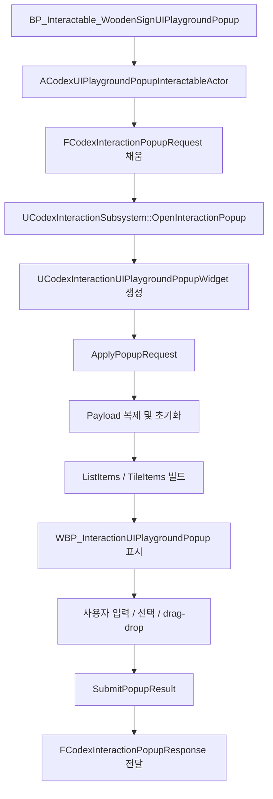
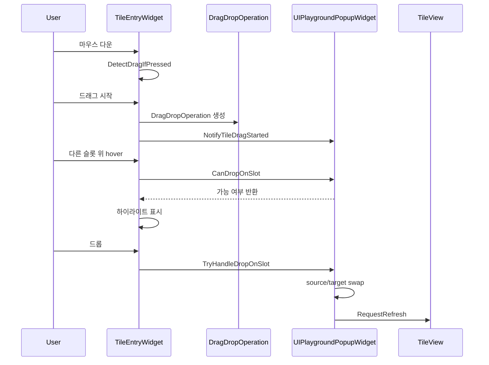

# UI Playground UMG 학습 가이드

## 문서 목적
- 이 문서는 `UI Playground Popup` 구현을 기준으로 Unreal UMG에서 여러 종류의 컨트롤을 한 팝업 안에 통합하는 방법을 학습하기 위한 문서다.
- 단순히 위젯을 배치하는 수준이 아니라, `팝업 오픈 흐름`, `payload 기반 상태`, `ListView/TileView`, `drag-drop`, `asset builder 기반 WBP 생성`이 어떻게 연결되는지 이해하는 것을 목표로 한다.
- 설계 문서는 [interaction_ui_playground_popup_plan.md](../interaction_ui_playground_popup_plan.md), 구현 체크리스트는 [interaction_ui_playground_popup_implementation_checklist.md](../interaction_ui_playground_popup_implementation_checklist.md) 를 참고한다.

## 이 구현으로 배우는 것
- `ECodexInteractionPopupStyle`에 새 팝업 스타일을 추가하고 서브시스템에 연결하는 방법
- `UObject` payload를 통해 팝업 초기 상태와 결과 상태를 주고받는 방법
- 한 팝업 안에서 `Basic`, `Input`, `Collection`, `Advanced` 섹션을 나누는 방법
- `ListView`와 `TileView`에서 item 객체와 entry widget을 분리하는 이유
- UMG drag-drop을 `entry widget 시작 + popup 중앙 처리` 구조로 설계하는 이유
- C++ 부모 클래스와 asset builder를 함께 써서 `WBP_*` 자산을 자동 생성하는 흐름

## 핵심 자산과 클래스

### 런타임 클래스
- `UCodexInteractionUIPlaygroundPopupWidget`
- `UCodexInteractionUIPlaygroundPayload`
- `UCodexInteractionUIPlaygroundListItem`
- `UCodexInteractionUIPlaygroundTileItem`
- `UCodexInteractionUIPlaygroundListEntryWidget`
- `UCodexInteractionUIPlaygroundTileEntryWidget`
- `UCodexUIPlaygroundDragDropOperation`
- `ACodexUIPlaygroundPopupInteractableActor`

### 생성되는 자산
- `/Game/UI/Interaction/WBP_InteractionUIPlaygroundPopup`
- `/Game/UI/Interaction/WBP_InteractionUIPlaygroundListEntry`
- `/Game/UI/Interaction/WBP_InteractionUIPlaygroundTileEntry`
- `/Game/Blueprints/Interaction/BP_Interactable_WoodenSignUIPlaygroundPopup`

### 관련 코드 위치
- 팝업 스타일/요청/응답: [CodexInteractionTypes.h](/d:/github/ue5_codex/CodexUMG/Source/CodexUMG/Public/Interaction/CodexInteractionTypes.h)
- 에셋 경로 상수: [CodexInteractionAssetPaths.h](/d:/github/ue5_codex/CodexUMG/Source/CodexUMG/Public/Interaction/CodexInteractionAssetPaths.h)
- 팝업 오픈 분기: [CodexInteractionSubsystem.cpp](/d:/github/ue5_codex/CodexUMG/Source/CodexUMG/Private/Interaction/CodexInteractionSubsystem.cpp)
- 팝업 본체: [CodexInteractionUIPlaygroundPopupWidget.h](/d:/github/ue5_codex/CodexUMG/Source/CodexUMG/Public/Interaction/CodexInteractionUIPlaygroundPopupWidget.h)
- payload: [CodexInteractionUIPlaygroundPayload.h](/d:/github/ue5_codex/CodexUMG/Source/CodexUMG/Public/Interaction/CodexInteractionUIPlaygroundPayload.h)
- 인터렉션 액터: [CodexUIPlaygroundPopupInteractableActor.h](/d:/github/ue5_codex/CodexUMG/Source/CodexUMG/Public/Interaction/CodexUIPlaygroundPopupInteractableActor.h)
- WBP/BP 자동 생성: [CodexInteractionAssetBuilder.cpp](/d:/github/ue5_codex/CodexUMG/Source/CodexUMGBootstrapEditor/Private/Interaction/CodexInteractionAssetBuilder.cpp)

## 전체 흐름



핵심은 세 단계다.
- 인터렉션 액터가 `PopupRequest`에 playground 전용 payload를 넣는다.
- 서브시스템이 `UIPlayground` 스타일을 보고 전용 팝업 위젯을 생성한다.
- 팝업 위젯이 payload를 복제해서 내부 상태로 사용하고, 닫을 때 결과를 다시 응답으로 넘긴다.

## 팝업 스타일 확장

이 구현의 시작점은 `ECodexInteractionPopupStyle` 확장이다.

```cpp
enum class ECodexInteractionPopupStyle : uint8
{
    Message,
    ScrollMessage,
    DualTileTransfer,
    UIPlayground
};
```

여기서 중요한 점은 새 enum 값만 추가해서 끝나지 않는다는 것이다.
- 에셋 경로 상수도 추가해야 한다.
- 서브시스템의 `ResolvePopupWidgetClass()` 분기에도 추가해야 한다.
- 실제 `OpenInteractionPopup()`에서 `CreateWidget<UCodexInteractionUIPlaygroundPopupWidget>` 분기도 넣어야 한다.

즉, 새 팝업 스타일은 `enum -> asset path -> subsystem routing -> runtime widget` 네 군데가 한 세트다.

## Payload 구조 이해하기

`UI Playground`는 일반 메시지 팝업보다 상태가 많다. 그래서 `FCodexInteractionPopupRequest` 안에 전용 payload 포인터를 넣었다.

```cpp
TObjectPtr<UCodexInteractionUIPlaygroundPayload> UIPlaygroundPayload = nullptr;
```

이 payload 안에는 다음 상태가 들어 있다.
- `Title`
- `StatusText`
- `InitialSection`
- `BasicDescription`
- `InputText`
- `bToggleValue`
- `SliderValue`
- `SpinValue`
- `SelectedPreset`
- `PresetOptions`
- `ListEntries`
- `TileSlots`

이 구조의 장점은 명확하다.
- 팝업 초기값을 한 객체로 묶을 수 있다.
- 인터렉션 액터 CDO에 인스턴스형 기본값을 붙일 수 있다.
- 팝업이 닫힐 때 수정된 상태를 다시 응답에 실어 보낼 수 있다.

## 왜 payload를 복제하는가

팝업 위젯은 `ApplyPopupRequest()`에서 payload를 그대로 쓰지 않고 복제해서 사용한다.

핵심 필드:
- `InitialPayloadSnapshot`
- `ActivePayload`

의도는 이렇다.
- `InitialPayloadSnapshot`: 리셋 기준점
- `ActivePayload`: 사용 중인 실제 상태

이 구조 덕분에 `ResetPopup()`에서 초기 상태로 쉽게 되돌릴 수 있다.  
실전 UI에서 이런 스냅샷 패턴은 자주 쓴다.

## 섹션 구조

팝업은 한 화면에 모든 컨트롤을 펼치지 않고 `WidgetSwitcher`로 섹션을 나눈다.

섹션 enum:

```cpp
enum class ECodexUIPlaygroundSection : uint8
{
    Basic,
    Input,
    Collection,
    Advanced
};
```

### 1. Basic
- 텍스트
- 버튼
- 버튼 pressed 상태에서 높이나 내부 padding이 바뀌면 테스트 UI 전체가 덜컥이므로, 눌림 피드백은 색과 음영 위주로 제한하는 편이 안정적이다.
- 이미지
- 라운딩
- blur 위에 올라가는 기본 카드형 레이아웃

### 2. Input
- `EditableTextBox`
- `CheckBox`
- `Slider`
- `SpinBox`
- `ComboBoxString`

### 3. Collection
- `ListView`
- 스크롤 영역
- 재사용 entry widget

### 4. Advanced
- `TileView`
- 선택 상태
- drag-drop

이렇게 나누면 좋은 이유:
- 포커스 충돌이 줄어든다.
- 테스트 실패 원인을 섹션 단위로 분리할 수 있다.
- 팝업은 하나지만 학습 포인트는 분리된다.

## BindWidget 관점에서 보는 WBP 구조

팝업 부모 클래스는 실제 WBP에 존재해야 하는 위젯 이름을 `BindWidget` 또는 `BindWidgetOptional`로 선언한다.

중요 바인딩:
- `TXT_Title`
- `TXT_Status`
- `TXT_BasicDescription`
- `ETB_InputText`
- `CHK_Toggle`
- `SLD_Value`
- `SPN_Value`
- `CB_Preset`
- `ListView_Items`
- `TileView_Slots`
- `Switcher_Sections`
- `BTN_Close`
- `BTN_Reset`
- `BTN_Submit`
- `BTN_TabBasic`
- `BTN_TabInput`
- `BTN_TabCollection`
- `BTN_TabAdvanced`

핵심 원칙:
- 런타임 코드가 위젯 트리를 직접 조립하지 않는다.
- 실제 위젯 트리는 WBP 자산에 있어야 한다.
- 따라서 asset builder가 생성하는 이름과 C++의 `BindWidget` 이름이 정확히 같아야 한다.

이 구현에서 commandlet 검증이 중요한 이유도 여기 있다. 이름이 하나라도 어긋나면 블루프린트 컴파일 경고가 난다.

## NativeConstruct에서 배우는 패턴

`NativeConstruct()`는 위젯 이벤트 연결의 중심이다.

여기서 하는 일:
- 버튼 클릭 delegate 연결
- 텍스트 입력 commit 연결
- 체크박스/슬라이더/스핀박스/콤보박스 변경 연결
- `ListView` 선택 변경 연결
- `TileView` 선택 변경 연결

중요한 점:
- 초기화와 사용자 이벤트를 섞지 않기 위해 `bIsRefreshingControls` 같은 guard 플래그를 둔다.
- 값을 코드로 세팅하는 동안에는 이벤트가 다시 payload를 덮어쓰지 않게 막는다.

이 패턴은 옵션창, 설정창, 에디터 도구 UI에서도 그대로 재사용할 수 있다.

## Input 섹션에서 배우는 것

이 팝업은 읽기 전용 메시지 UI에서 한 단계 더 가서 실제 입력 상태를 관리한다.

대표 흐름:
- `RefreshInputSection()`이 payload 값을 위젯에 밀어 넣는다.
- 사용자가 값을 바꾸면 각 핸들러가 `ActivePayload`를 갱신한다.
- 닫을 때 `CopyInputControlsToPayload()`가 최종 위젯 값을 한 번 더 payload에 반영한다.

즉, 구조는 이렇게 보면 된다.

```text
payload -> 위젯 초기화
사용자 입력 -> payload 업데이트
닫기 직전 -> 위젯 값 재동기화
```

이런 이중 동기화가 있는 이유는:
- 일부 컨트롤은 실시간 반영
- 일부는 commit 시점 반영
- 일부는 중간에 값이 비어 있을 수 있기 때문이다

## ListView 학습 포인트

`Collection` 섹션은 `ListView`를 사용한다. 여기서 제일 중요한 건 item과 entry widget의 분리다.

### item
- `UCodexInteractionUIPlaygroundListItem`
- 데이터와 상태를 가진다.
- `Title`, `Description`, `StateText`, `TintColor`, `bIsEnabled`, `bIsSelected`

### entry widget
- `UCodexInteractionUIPlaygroundListEntryWidget`
- 화면 표현만 담당한다.
- `NativeOnListItemObjectSet()`에서 item을 받아 `RefreshVisualState()`로 그린다.

즉:

```text
ListView
  -> UObject item 목록을 가짐
  -> 화면에 보이는 것만 entry widget 생성
  -> entry widget은 item을 읽어서 그림
```

중요한 교훈:
- entry widget은 영구 상태 저장소가 아니다.
- 진짜 상태는 popup widget의 `ListItems` 배열에 있다.

## TileView와 drag-drop 학습 포인트

`Advanced` 섹션은 `TileView`와 drag-drop을 붙인 구조다.

### tile item
- `UCodexInteractionUIPlaygroundTileItem`
- `SlotIndex`
- `Label`
- `Value`
- `TintColor`
- `bIsEmpty`
- `bIsSelected`
- `Section`

### tile entry widget
- `UCodexInteractionUIPlaygroundTileEntryWidget`
- drag 시작
- drop target 하이라이트
- label/value/tint 렌더링

### drag payload
- `UCodexUIPlaygroundDragDropOperation`
- source item 참조
- source slot index
- source section

## drag-drop을 popup 중앙에서 처리하는 이유

이 구현에서 drag는 entry widget이 시작하지만, drop 판정과 실제 데이터 변경은 popup widget이 담당한다.

이유:
- `TileView` entry widget은 재사용된다.
- entry widget이 자기 주변 전체 상태를 알기 어렵다.
- 어떤 슬롯에 drop 가능한지 판단하려면 상위 배열 상태를 봐야 한다.

그래서 역할을 나누면:
- entry widget
  - `NativeOnMouseButtonDown`
  - `NativeOnDragDetected`
  - hover 시 하이라이트 표시
- popup widget
  - `CanDropOnSlot`
  - `TryHandleDropOnSlot`
  - 실제 swap
  - payload 반영
  - refresh

이 구조가 `TileView` 계열 UMG에서 가장 안정적이다.

## drag-drop 실제 흐름



핵심 구현 포인트:
- `CanDropOnSlot()`은 null, 자기 자신, 섹션 불일치 등을 필터링한다.
- `TryHandleDropOnSlot()`은 실제로 `SlotIndex`, `Label`, `Value`, `TintColor`, `bIsEmpty`를 swap한다.
- 이후 `CopyTileItemsToPayload()`로 payload를 최신 상태로 갱신한다.

## 키보드 네비게이션 학습 포인트

`NativeOnKeyDown()`에서 처리하는 입력:
- `Escape` -> 닫기
- `Enter`, `SpaceBar` -> 제출
- `Tab`, `Shift+Tab` -> 섹션 순환

이 구현이 좋은 이유는:
- 버튼 클릭만 테스트하는 팝업이 아니다.
- 키보드/패드 네비게이션 검증까지 한 번에 할 수 있다.
- 팝업 UI에서 흔히 깨지는 `close`, `submit`, `section cycle` 흐름을 먼저 잡을 수 있다.

## Interactable Actor에서 배우는 것

`ACodexUIPlaygroundPopupInteractableActor`는 기존 `ACodexPopupInteractableActor`를 상속한다.

여기서 하는 일:
- 기본 제목/메시지 설정
- `UIPlaygroundPayload` 인스턴스 생성
- 샘플 리스트/타일 데이터 채우기
- `GetPopupStyle()`에서 `UIPlayground` 반환
- `PopulatePopupRequest()`에서 payload를 request에 넘기기

즉, 인터렉션 액터는 “무슨 팝업을 열지” 뿐 아니라 “그 팝업의 초기 상태가 무엇인지”도 책임진다.

## Asset Builder에서 배우는 것

이 구현은 수동으로 WBP를 만드는 대신 asset builder가 생성한다.

관련 함수:
- `ConfigureUIPlaygroundListEntryWidgetBlueprint()`
- `ConfigureUIPlaygroundTileEntryWidgetBlueprint()`
- `ConfigureUIPlaygroundPopupWidgetBlueprint()`
- `ConfigureUIPlaygroundPopupInteractableBlueprint()`

여기서 배울 수 있는 것:
- `WidgetTree`를 코드로 만드는 방법
- `EnsureWidgetGuid()`가 왜 필요한지
- `BindWidget`용 이름을 어떻게 고정하는지
- native class 부모가 있는 WBP를 자동 생성하는 방법
- 생성한 자산을 `BasicMap`까지 자동 배치하는 방법
- 팝업 전체 `TintPanel` padding과 좌측 탭 컬럼 padding을 따로 조정해 상단 breathing room을 만드는 방법
- `FButtonStyle::SetPressedPadding()`을 normal과 동일하게 맞춰 버튼 눌림 시 높이 변화와 레이아웃 덜컥임을 막는 방법

특히 이번 작업에서 중요한 교훈은 이거다.
- WBP에 위젯을 추가만 하면 안 된다.
- `GUID`가 빠지면 UMG 컴파일러가 variable widget으로 인식하지 못한다.
- 그래서 builder에서 `EnsureWidgetGuid()`를 빼먹지 않아야 한다.

## commandlet 검증이 중요한 이유

이번 구현은 실제로 다음 두 단계로 검증했다.
- `CodexUMGEditor` C++ 빌드
- `CodexInteractionAssetBuild` commandlet 실행

왜 둘 다 필요하냐면:
- C++ 빌드는 타입/헤더/링크 오류만 잡는다.
- commandlet은 실제 `WBP` 생성과 블루프린트 컴파일까지 검증한다.

UMG 작업에서는 두 번째가 특히 중요하다.  
`BindWidget` 이름 불일치, GUID 누락, 잘못된 위젯 트리 구성은 commandlet에서 바로 드러난다.

## 코드 읽기 추천 순서

1. [CodexInteractionTypes.h](/d:/github/ue5_codex/CodexUMG/Source/CodexUMG/Public/Interaction/CodexInteractionTypes.h)
2. [CodexInteractionUIPlaygroundPayload.h](/d:/github/ue5_codex/CodexUMG/Source/CodexUMG/Public/Interaction/CodexInteractionUIPlaygroundPayload.h)
3. [CodexUIPlaygroundPopupInteractableActor.h](/d:/github/ue5_codex/CodexUMG/Source/CodexUMG/Public/Interaction/CodexUIPlaygroundPopupInteractableActor.h)
4. [CodexInteractionSubsystem.cpp](/d:/github/ue5_codex/CodexUMG/Source/CodexUMG/Private/Interaction/CodexInteractionSubsystem.cpp)
5. [CodexInteractionUIPlaygroundPopupWidget.h](/d:/github/ue5_codex/CodexUMG/Source/CodexUMG/Public/Interaction/CodexInteractionUIPlaygroundPopupWidget.h)
6. `CodexInteractionUIPlaygroundListItem/TileItem`
7. `CodexInteractionUIPlaygroundListEntryWidget/TileEntryWidget`
8. [CodexInteractionAssetBuilder.cpp](/d:/github/ue5_codex/CodexUMG/Source/CodexUMGBootstrapEditor/Private/Interaction/CodexInteractionAssetBuilder.cpp)

이 순서로 읽으면:
- 타입
- 요청 데이터
- 인터렉션 진입점
- 팝업 위젯
- 리스트/타일 렌더링
- WBP 자동 생성

순으로 자연스럽게 따라갈 수 있다.

## 직접 해볼 만한 확장 과제

### 쉬운 과제
- `StatusText`에 마지막 클릭 버튼 이름도 넣기
- `Basic` 섹션 progress 값을 slider와 연동하기
- `Collection` 섹션에 disabled item 추가하기

### 중간 과제
- `MultiLineEditableTextBox`도 payload에 저장하도록 확장하기
- `ListView` 아이템 추가/삭제를 실제 payload에도 반영하기
- `Advanced` 섹션 drop 규칙을 더 엄격하게 만들기

### 어려운 과제
- 게임패드 포커스 이동 시 현재 포커스 위젯을 status bar에 노출하기
- drag-drop 결과를 실제 게임 데이터 구조와 연결하기
- `UI Playground`를 단일 팝업이 아니라 재사용 가능한 테스트 프레임워크로 확장하기

## 요약

이 구현은 “팝업 하나 더 만든 작업”으로 보면 아깝다.  
실제로는 Unreal UMG에서 다음을 한 번에 익히는 예제다.

- 새 popup style 추가
- subsystem routing
- payload 기반 상태 관리
- WidgetSwitcher 섹션 분리
- 입력 컨트롤 동기화
- `ListView` item/entry 분리
- `TileView` drag-drop
- asset builder 기반 WBP 자동 생성
- commandlet 검증

한 줄로 정리하면 이렇다.

```text
인터렉션 액터가 payload를 담아 팝업을 열고,
팝업은 payload를 내부 상태로 복제해 여러 UMG 컨트롤을 테스트하며,
닫을 때 결과 상태를 다시 subsystem으로 돌려준다.
```

이 흐름을 이해하면 이후의 설정창, 인벤토리, 도구성 팝업도 같은 방식으로 확장할 수 있다.
